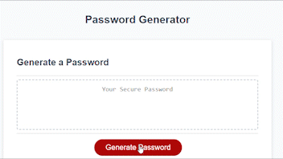

# JavaScript Password Generator

## Description

This webpage was created to showcase professional work and provide an introduction to myself. This webpage was built to give future employers an opportunity get to know the projects I have worked on, what my interests are and how to contact me. The webpage also includes a link to my resume. During the making of this project, I learned the importance of UI design and the many interesting ways to elevate the front end of a webpage.

## Usage

To use this webpage, at the top right hand side are navigational links to three different sections. When clicking on a topic, the browser will move to the section that contains that topics of information. 

[Password Generator](https://k-pineda.github.io/JavaScript_Password_Generator/)

## Credits

[Challenge 3 Repo](https://github.com/k-pineda/JavaScript_Password_Generator.git)
